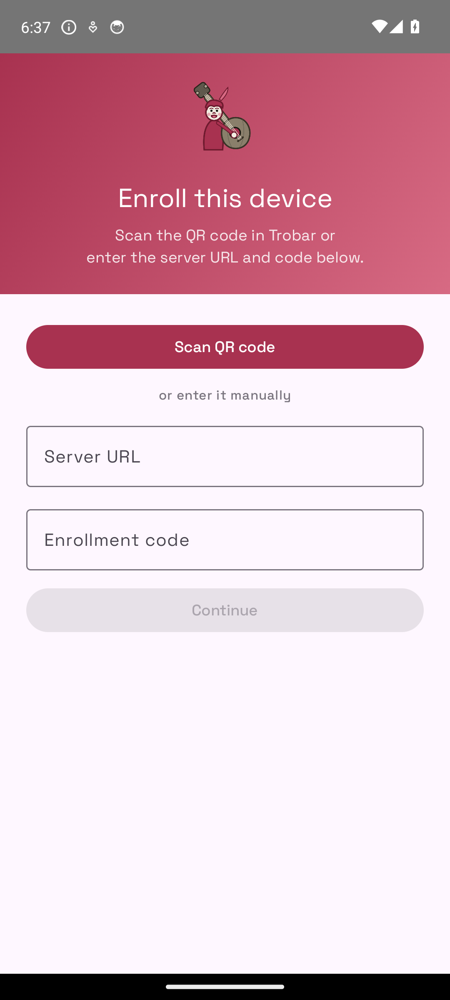
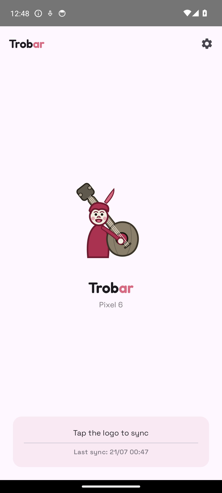
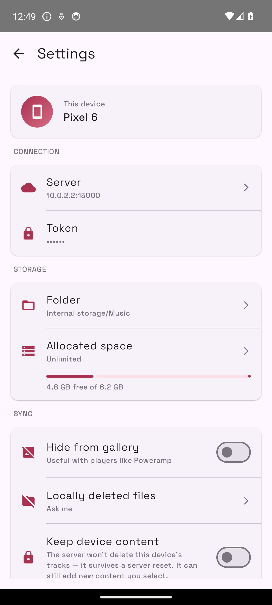
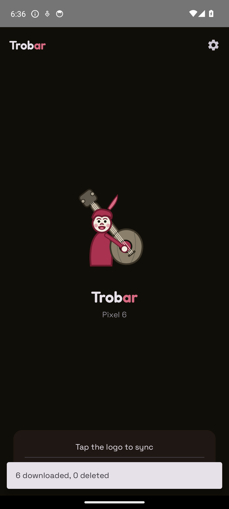
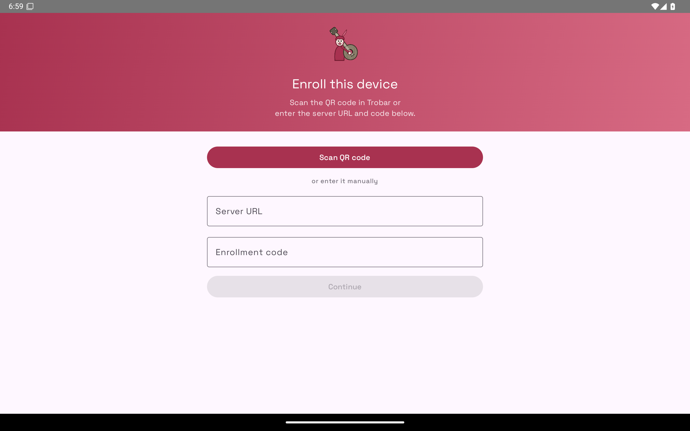

<!--
SPDX-FileCopyrightText: 2026 missing-foss

SPDX-License-Identifier: GPL-3.0-or-later
-->

# Trobar for Android

[](https://securityscorecards.dev/viewer/?uri=github.com/missing-foss/trobar-android)

The Android client of [Trobar](https://github.com/missing-foss/trobar-server)
— self-hosted music library sync. Pick artists, albums, or playlists in the
web app; this client keeps them offline on the phone, tablet, watch, or
Android-based DAP, in original quality (or transcoded, if the device is set
up that way server-side).

## Screenshots

<p align="center">
  
  
  
  
</p>

<sub>Enroll · sync status · settings · dark theme. Captured on a Pixel 6
emulator against the synthetic dev library — no real or copyrighted content.
More (syncing, synced, enrollment config, dark settings) under
[`docs/screenshots/`](docs/screenshots/).</sub>

<p align="center">
  
</p>

<sub>On tablets and foldables the layout adapts (#38) — content is centred at a
readable max-width instead of stretched edge-to-edge.</sub>

## Install

**With [Obtainium](https://github.com/ImranR98/Obtainium)** (recommended — automatic updates):
in Obtainium tap **Add App** and paste the repository URL:

```
https://github.com/missing-foss/trobar-android
```

That's the reliable method everywhere. There's also a one-tap button:

[](https://apps.obtainium.imranr.dev/redirect?r=obtainium://add/https://github.com/missing-foss/trobar-android)

**Without Obtainium**: download the APK from
[Releases](https://github.com/missing-foss/trobar-android/releases)
(tags `android-vX.Y.Z`) and install it.

## Verifying the download

Release APKs are signed with the maintainer's key. You can confirm any APK
you download is a genuine build by checking its signing certificate:

```
apksigner verify --print-certs trobar-<version>.apk
```

The **SHA-256 of the signing certificate** must be:

```
67:4A:EA:87:4A:B6:99:6A:04:47:10:29:39:71:57:07:E9:5D:DB:00:ED:04:3E:2B:4E:22:83:73:07:F0:F3:76
```

Obtainium pins this automatically after the first install and warns you if a
later update is ever signed by a different key.

> Note: releases up to and including `android-v2.5.1` were signed with an
> older key and carry a different fingerprint. `android-v2.6.0` switched to
> the certificate above — updating across that boundary needs a one-time
> uninstall + reinstall (Android rejects a signing-key change).

## Pair

Create a device in the Trobar web app and scan the QR code with the app's
pairing screen, then pick a sync folder. Full walkthrough:
[the Android client guide](https://missing-foss.github.io/trobar-server/clients/android/)
in the Trobar documentation.

## Build

Standard Gradle project: `./gradlew assembleDebug`. Release builds are
signed with the maintainer's key; to sign your own, set the
`TROBAR_KEYSTORE*` environment variables (see the server repository's
`docs/troubleshooting.md`) — and keep using the same keystore forever,
Android refuses updates across a signature change.

## License

`GPL-3.0-or-later` — see [LICENSE](LICENSE). Contributions are welcome
under the same license; see [CONTRIBUTING.md](CONTRIBUTING.md).
